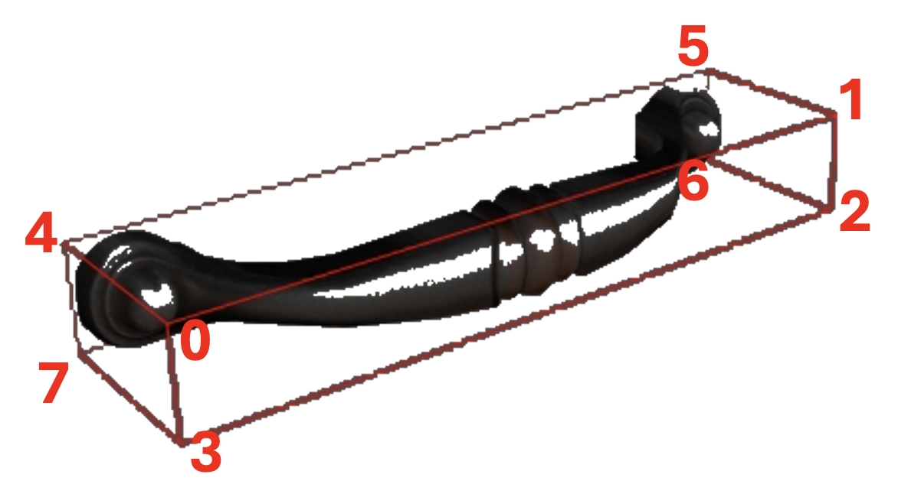

# Part Interaction

## How to run the code
Control the arm to open a drawer demo:
```bash
python run.py --mode run_arti_open
```

Control the arm to any pose demo:
```bash
python run.py --mode run_arti_free_control
```

We also add some random ycb data in the scene to randomize the scene. See `task_config.json` for more details.

## Par Information

### Part Annotation Usage

See the code in `object_gym.py` for more details.

```python

def get_gapartnet_anno(self):
    '''
    Get gapartnet annotation
    '''
    self.gapart_cates = []
    self.gapart_init_bboxes = []
    self.gapart_link_names = []
    self.gapart_raw_valid_annos = []
    for gapartnet_id in self.gapartnet_ids:
        # load object annotation
        annotation_path = f"{self.asset_root}/gapartnet/{gapartnet_id}/link_annotation_gapartnet.json"
        anno = json.loads(open(annotation_path).read())
        num_link_anno = len(anno)
        gapart_raw_valid_anno = []
        for link_i in range(num_link_anno):
            anno_i = anno[link_i]
            if anno_i["is_gapart"]:
                gapart_raw_valid_anno.append(anno_i)
        self.gapart_raw_valid_annos.append(gapart_raw_valid_anno)
        self.gapart_cates.append([anno_i["category"] for anno_i in gapart_raw_valid_anno])
        self.gapart_init_bboxes.append(np.array([np.asarray(anno_i["bbox"]) for anno_i in gapart_raw_valid_anno]))
        self.gapart_link_names.append([anno_i["link_name"] for anno_i in gapart_raw_valid_anno])
```


### Part Bbox index information

The permutation of GAPart IDs is as follows:

